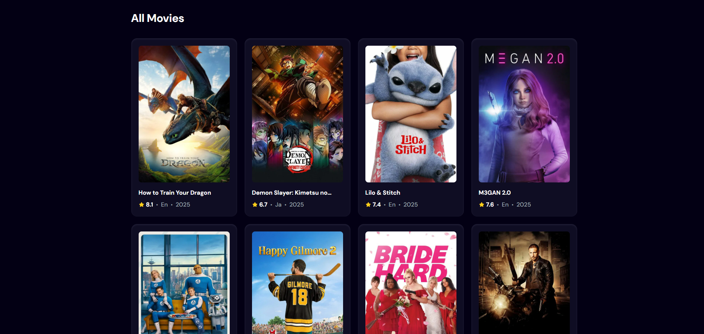

# 🎬 Movie Searcher

Welcome to **Movie Searcher**, the ultimate destination to find and explore **every movie ever made**! Whether you're a film enthusiast, a casual viewer, or just looking for something to watch — this sleek and responsive app lets you **search for any movie** in seconds.

🌐 **Live Preview**:  
🔗 [Click here to explore now](https://movies-searcher-one.vercel.app/)

---

## ✨ Features

- 🔎 **Search Any Movie Instantly**
- 🖼️ View **Movie Posters**
- 📝 Get Detailed Info: Title, Year, Type, etc.
- ⚡ Fast, Responsive & User-friendly UI
- 🌙 Clean & Minimalist Design

---

## 📸 Screenshots

| Search View | Movie Results |
|-------------|----------------|
|  |  |

> *(Replace with your own screenshots if available for better showcase)*

---

## 🚀 Tech Stack

- **Frontend**: HTML, CSS, JavaScript (React)
- **API**: [TMDB API](https://www.themoviedb.org/) or similar movie database
- **Deployment**: Vercel

---

## 🛠️ Getting Started

### Clone the Repository

```bash
git clone https://github.com/your-username/movie-searcher.git
cd movie-searcher
